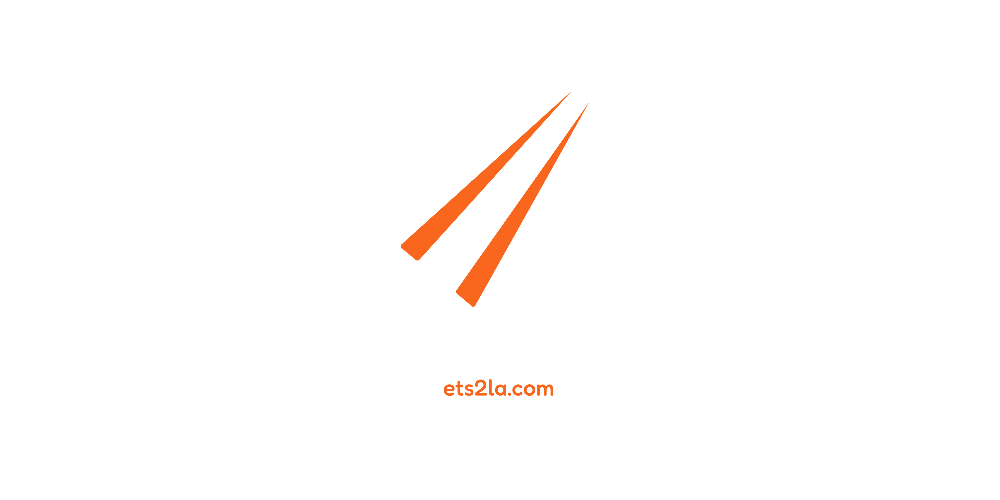

# ETS2LA
ETS2LA is a project that aims to finally bring self-driving technology to SCS Software's Truck Simulators. This page includes some information, but if you want to read all the documentation then please head over to [our website](https://ets2la.com)!

 

{.callout}
> Okay so I don't mean to spam this channel with my absolute excitement for this program, because I have already told you guys how much I love it, but I think it bears repeating one more time that I am in a wheelchair and do not have the manual dexterity to play this game on my own and it is ONLY because of this program that I am able to play the game! I absolutely love it and I really want the developers to know that I appreciate all their hard work into making this program. There is a sense of satisfaction that comes from being able to drive in a simulator when I can't even do it in the real world because of my disability. 🙂
> 
> **Unnamed User** - ETS2LA Discord

### Important Links
- [Download](https://ets2la.com/download) - Instructions on how to download and install the current version.
- [Discord](https://ets2la.com/discord) - Join our community to talk to the developers and get support.
- [Website](https://ets2la.com) - For troubleshooting and help. *Out of date with the current version!*
- [Docs](https://docs.ets2la.com) - Developer documentation. If you want to work on ETS2LA or plugins you should start here.

### I have a problem with ETS2LA
Please check the [FAQ](https://ets2la.com/faq) for answers. If your question is not listed there, please join the [Discord](https://ets2la.com/discord) and ask in the support channel. We will add the answer to the FAQ if it becomes a common question!

### Acknowledgements
- [SCS Software](https://scssoft.com) - For making Euro Truck Simulator 2 and American Truck Simulator.
- [TruckLib](https://github.com/sk-zk/TruckLib) - For being the project we use to extract game files. This version of ETS2LA is fundamentally linked to TruckLib.
- [ts-map](https://github.com/dariowouters/ts-map) and [maps](https://github.com/truckermudgeon/maps) - For their help and examples in parsing SCS map files and rendering a usable map.

* * *

[!ref Screenshots and Videos](/media.md)